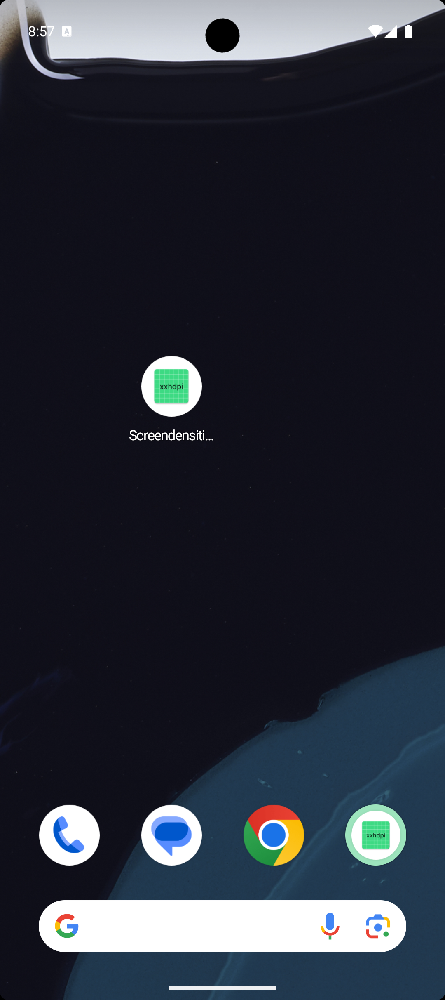
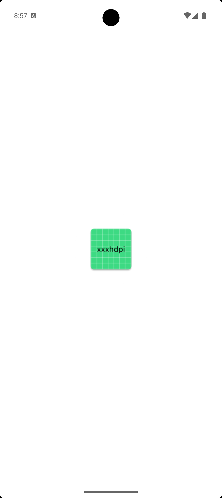
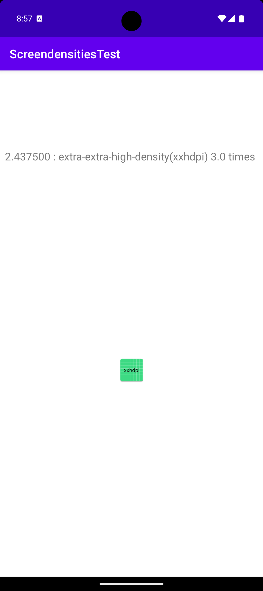

# はじめに
Android Studioのテンプレートプロジェクトを作成すると、仮に`minSDKVersion`が高いものに設定したとしても、 
必ずLegacy Iconもデフォルトで追加される。Legacy Icon(pngファイル)を格納しているフォルダはresフォルダ配下の以下のディレクトリ 
- `mipmap-hdpi` , `mipmap-mdpi`、`mipmap-hdpi`, `mipmap-xdpi`, `mipmap-xxdpi`, `mipmap-xxxdpi` 

テンプレートからの作成だと、解像度別に作成された不要なアイコンが多すぎるので 
不必要なアイコンを探す目的で本アプリを作成した。 

# 環境

本アプリを使った調査は、以下のAndroid Studioのバージョンで作成できるテンプレートプロジェクトをBaseに行っています。 
gradleのバージョンをアップしたのでAndroid Studio Koalaでプロジェクトを実行できます。 

# 結論
- `minSDKVersion`がAPI Level 26以上であれば、どの解像度の端末でも ランチャーアイコンは、`res/mipmap-anydpi-v26/` 配下の`Adaptive Icon`を使う
- OS ver 8.0未満であれば、`Legacy Icon`を使う
- `Adaptive Icon`のアニメーションは各端末のホームアプリに依存する。なので、OSver 8.0以上であれば必ずアニメーションが適用されるとは限らない
    - Pixcelシリーズに入ってるホームアプリの`Pixel Launcher`のVersion `8.1.0-4429924`以上でアニメーションが効くことを確認済み
    - Ver OMR1-4113793 では、アニメーションされなかった
- [アプリのランチャーアイコンは必ずmipmap配下に格納する](https://developer.android.com/training/multiscreen/screendensities?hl=ja#mipmap)
    - **ランチャーアイコンは、ホームアプリによっては、デバイスの解像度より25%大きく表示される**。
    - drawable配下の画像は使う解像度以外のファイルはAPKに含まない ※[App Bundleでアプリを公開した場合](https://developer.android.com/topic/performance/reduce-apk-size?hl=ja)
    - mipmap配下の画像は全ての解像度のファイルをAPKに含む ※ App Bundle形式であっても。
    - 画像は拡大するよりも、縮小する方が画質劣化が少ないので、mipmap配下にランチャーアイコンを配置すべき
- 円形のアイコン`ic_launcher_round`と通常のアイコン`ic_launcher`を２つ用意している理由は、HOMEアプリによっては円形のアイコンをサポートしてない機種があるから。
    - `AndroidManifest.xml`で２パターンで設定してる: `android:icon="@mipmap/ic_launcher"``android:roundIcon="@mipmap/ic_launcher_round"`

# mipmapとdrawableについて
[詳細はこちら](https://github.com/LeoAndo/ScreendensitiesTest/blob/main/document/about_mipmap_and_drawable_directory.key) 

# アプリ公開形式を変えてアプリをリリースし、APKファイルの最適化を検証 (decompile)
[詳細はこちら](https://github.com/LeoAndo/ScreendensitiesTest/blob/main/document/about_mipmap_and_drawable_directory.key) 

# Capture

## 480 x 800 hdpi  Nexus S API 28

| drawable | mipmap | drawable | mipmap
|:---|:---:|:---:|:---:|
| `drawable-hdpi` | `mipmap-anydpi-v26` | | |

## 1080 x 1920 xxhdpi  Nexus 5 API 24

**mipmapは、`xxxhdpi`を使っているのに注目！ 誤植ではない。**
| drawable | mipmap | drawable | mipmap
|:---|:---:|:---:|:---:|
| `drawable-xxhdpi` | `mipmap-xxxhdpi` | | |

## 1080 x 2424 xxhdpi  Pixel 9 Pro Fold API 35
**mipmapフォルダを全削除したテスト。スプラッシュに表示されるアイコンはデフォルトでランチャーアイコンが適用されるがxxxhdpiが適用されているのが面白い**
| ランチャーアイコン(xxhdpi) | OS12以降で出すスプラッシュアイコン(xxxhdpi) | 画面(xxhdpi) | -
|:---|:---:|:---:|:---:|
|  |  | | - |

# Capture (Adaptive IconのAnimationが効いてる場合)

**droid君が動いてることが確認できる！！**

# Pixcelシリーズに入ってるホームアプリの`Pixel Launcher`のVersionの確認方法

ホーム長押し > 「ホームの設定」をクリック > 「概要」をクリック > 「バージョン」を確認する

# Links
[各種のピクセル密度をサポートする](https://developer.android.com/training/multiscreen/screendensities?hl=ja) 
[解像度の早見表](https://developer.android.com/training/multiscreen/screendensities?hl=ja#TaskProvideAltBmp) 
[Adaptive Icon](https://developer.android.com/guide/practices/ui_guidelines/icon_design_adaptive?hl=ja) 
